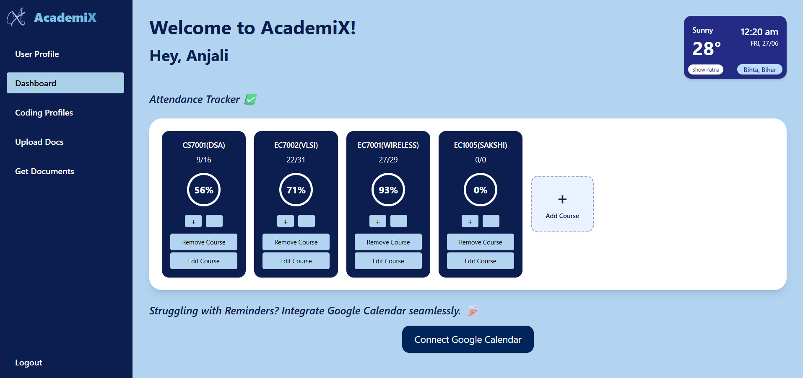
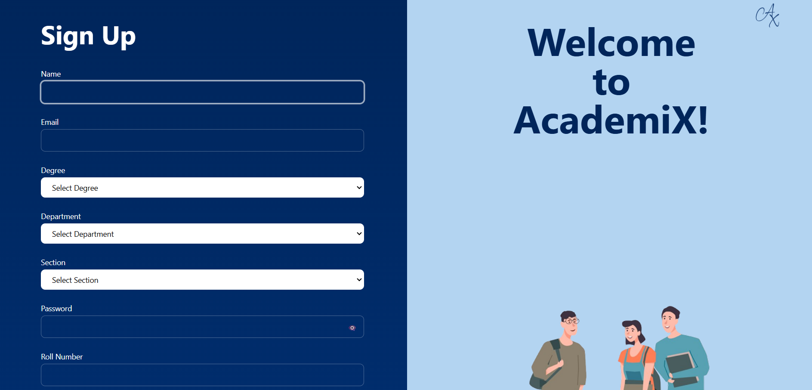
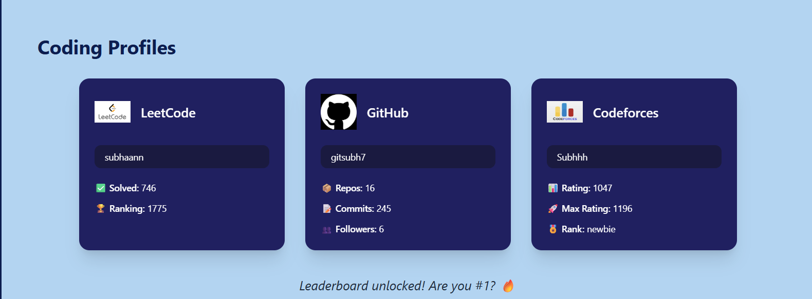
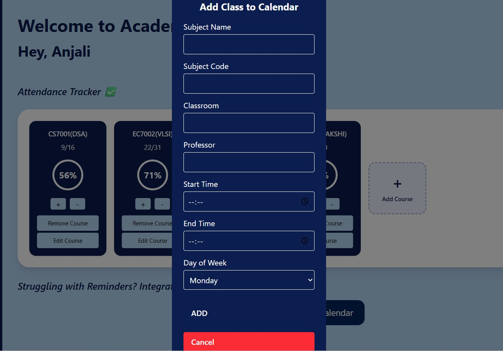
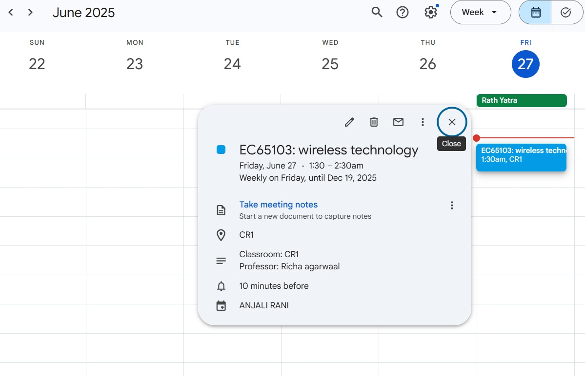
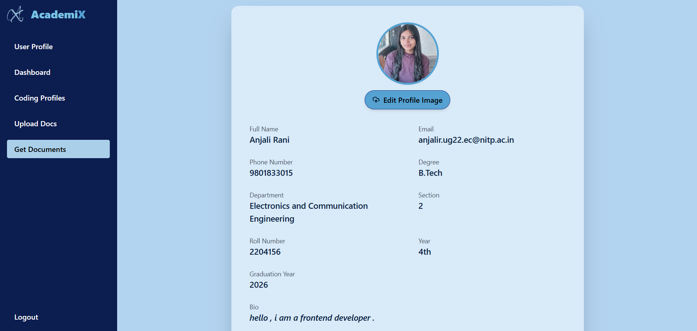
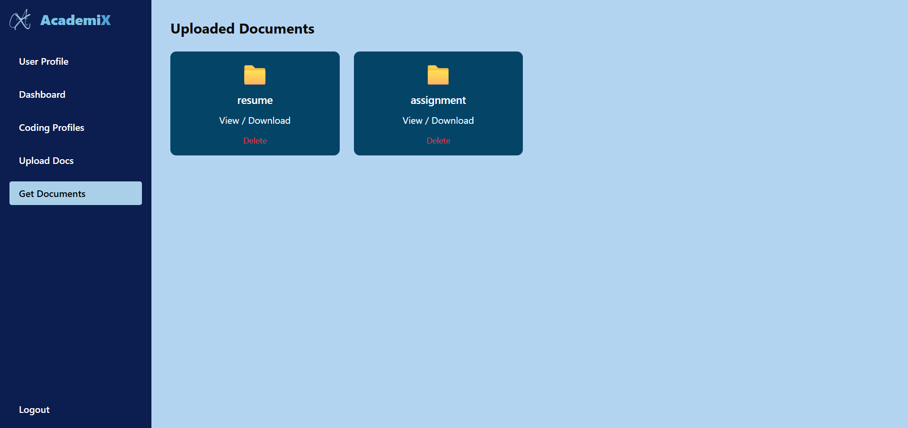

<h1 align="center" id="title">AcademiX</h1>

<p align="center">
  
</p>


<p id="description">AcademiX is a dynamic full‑stack student dashboard built with Node.js Express Flask React and MongoDB enhanced by Python and dlib-powered facial recognition Cloudinary media storage Nodemailer for secure password recovery and styled with Tailwind CSS. It seamlessly integrates RESTful and GraphQL APIs features live weather updates and syncs class reminders with Google Calendar. Students can track attendance across over five subjects monitor coding performance from three platforms and securely store academic documents—all within one intelligent and responsive portal. This well-structured dashboard exemplifies modern best practices in e-learning platforms and dashboard design.</p>


## 💻 Built With

Technologies used in the project:

<table>
  <tr>
    <td><strong>Node.js</strong></td>
    <td><strong>Express.js</strong></td>
    <td><strong>React.js</strong></td>
  </tr>
  <tr>
    <td><strong>MongoDB</strong></td>
    <td><strong>Flask</strong></td>
    <td><strong>Cloudinary</strong></td>
  </tr>
  <tr>
    <td><strong>Google Calendar API</strong></td>
    <td><strong>Python</strong></td>
    <td><strong>dlib</strong></td>
  </tr>
  <tr>
    <td><strong>Tailwind CSS</strong></td>
    <td><strong>Nodemailer</strong></td>
    <td><strong>RESTful APIs</strong></td>
  </tr>
  <tr>
    <td><strong>GraphQL APIs</strong></td>
    <td></td>
    <td></td>
  </tr>
</table>


<h2>🛠️ Installation Steps:</h2>

<p>1. Clone Repository</p>

```
git clone https://github.com/gitsubh7/AcademiX.git 
```

<p>2. Enter into the Directory</p>

```
cd AcademiX
```

<p>3. Enter Backend</p>

```
cd Backend
```

<p>4. Install Backend Dependencies</p>

```
npm install 
```

<p>5. Enter Frontend</p>

```
cd ..
cd Frontend
```

<p>6. Install Frontend Dependencies</p>

```
npm install
```

<p>7. Setup Environment Variables ( create same .env in ML folder and Backend Folder)</p>

```
Refer in the next section
```

<p>8. Launch Backend</p>

```
cd ..
cd Backend
npm run dev
```

<p>9. Launch Frontend</p>

```
cd ..
cd Frontend
npm run dev
```

<p>10. Setup ML Server</p>

```
cd .. 
pip install -r requirements.txt
python face_recog.py
```

<p> 🌍 Frontend URL </p>

```
http://localhost:3001
```


  


## 🔐 Environment Variables

The backend server uses the following environment variables, which should be configured in a `.env` file at the root of the project:

### 🗄️ Database
- `MONGODB_URI` – MongoDB connection string (use your own MongoDB Atlas URI or local URI)

### 🌐 Server Configuration
- `PORT` – Main backend server port (e.g., 3000)
- `PORT2` – Additional port (e.g., for testing/microservices)
- `CORS_ORIGIN` – Allowed origin for CORS requests (`*` for public, or restrict to frontend URL)
- `FRONTEND_ORIGIN` – Frontend application origin (used in cookies/CORS)

### 🔑 JWT Authentication
- `ACCESS_TOKEN_SECRET` – Secret key for generating JWT access tokens
- `REFRESH_TOKEN_SECRET` – Secret key for generating JWT refresh tokens
- `ACCESS_TOKEN_EXPIRY` – Expiry duration for access tokens (e.g., `15m`)
- `REFRESH_TOKEN_EXPIRY` – Expiry duration for refresh tokens (e.g., `7d`)
- `JWT` – Additional JWT secret (used for fallback or legacy purposes)

### ☁️ Cloudinary (Image & File Storage)
- `CLOUDINARY_CLOUD_NAME` – Cloudinary cloud name
- `CLOUDINARY_API_KEY` – API key for Cloudinary
- `CLOUDINARY_API_SECRET` – API secret for Cloudinary

### 📧 Email Configuration (for password reset/OTP)
- `EMAIL` – Sender Gmail address (used via Nodemailer)
- `PASSWORD` – App password or SMTP password for the email account

### 📅 Google Calendar API
- `GOOGLE_API_KEY` – Google Cloud API Key
- `GOOGLE_CLIENT_ID` – OAuth2 client ID from Google Cloud Console
- `GOOGLE_CLIENT_SECRET` – OAuth2 client secret
- `GOOGLE_REDIRECT_URI` – OAuth2 redirect URI (must match Google Cloud Console setting)

---

> ⚠️ **Important:** Never commit your `.env` file to version control (e.g., GitHub). Always add it to your `.gitignore`.


## 🌐 API Documentation

### 🔗 Base URL
- `http://localhost:3000/api/v1`

---

## 📦 Student Routes (`/student`)

### 🔐 Authentication
- `POST /student/register`  
  Register a new student (with profile image upload using `image_url` field).

- `POST /student/login`  
  Login student and receive JWT token.

- `POST /student/logout`  
  Logout the student (requires JWT).

---

### 👤 Profile Management
- `GET /student/getStudent`  
  Get the currently logged-in student's profile.

- `POST /student/updateStudent`  
  Update student profile data.

- `POST /student/updateProfileImage`  
  Update profile image (requires image file via `image_url` field).

- `POST /student/changePassword`  
  Change password for authenticated user.

---

### 🔑 Password Reset
- `POST /student/requestPasswordReset`  
  Request password reset (OTP/email-based).

- `POST /student/passwordReset`  
  Complete password reset using OTP/token.

---

## 📚 Course Management
- `POST /student/addCourse`  
  Add a new course to the student's profile.

- `POST /student/editCourse`  
  Edit an existing course.

- `DELETE /student/removeCourse`  
  Remove a course from the profile.

---

## 📝 Attendance
- `POST /student/markAbsent`  
  Mark the student as absent.

- `POST /student/markPresent`  
  Mark the student as present.

- `GET /student/getAttendance`  
  Retrieve attendance history and summary.

---

## 🗃️ Document Management
- `POST /student/uploadDocument`  
  Upload a document file (requires `localDocument` field).

- `GET /student/getAllDocuments`  
  Get all uploaded documents for the student.

- `DELETE /student/deleteDocument/:id`  
  Delete a document by its ID.

---

## 📅 Google Calendar Integration
- `GET /student/google`  
  Start Google OAuth2 login flow.

- `GET /student/google/redirect`  
  Handle OAuth2 redirect, save tokens.

- `POST /student/addClass`  
  Add a class event to Google Calendar.

---

## 👨‍💻 Coding Profiles
- `GET /student/github/:username`  
  Get public GitHub profile data.

- `GET /student/codeforces/:username` *(JWT required)*  
  Get Codeforces user data.

- `GET /student/leetcode/:username` *(JWT required)*  
  Get LeetCode user profile data.

---

### 🏆 Coding Rankings
- `GET /student/codeForcesRankings`  
  Global Codeforces leaderboard.

- `GET /student/leetcodeRankingsC`  
  LeetCode contest-based rankings.

- `GET /student/leetcodeRankingsQ`  
  LeetCode problem-solved-based rankings.

---

## 🌦️ Weather API (`/weather`)
- `GET /weather/patna`  
  Get real-time weather details for Patna.

- `GET /weather/bihta`  
  Get real-time weather details for Bihta.


## 🖼️ Project Screenshots


### 📊 Signup View


### 📝 Coding Profiles


### 📝 Add Class to Google Calendar




### 📝 User Profile


### 📝 Documents



## 🍰 Contributors

- [**Abdul Subhan**](https://github.com/gitsubh7)
- [**Anjali Rani**](https://github.com/Anjali28082003)

